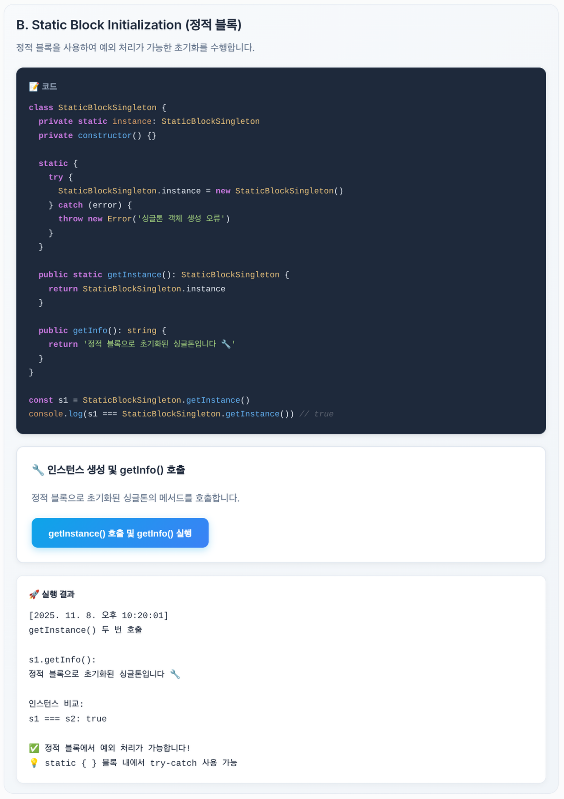

# design-pattern

**[웹사이트 바로가기](https://lxxzdrgnl.github.io/design-pattern/)**

제공된 6개 디자인 패턴 예제 코드(Vue + TypeScript) 를 실행해보고, 실행 결과 화면을 캡처하는 대신 홈페이지 내의 코드 실행으로 대체하였습니다.



## Project Setup

```sh
npm install
```

### Compile and Hot-Reload for Development

```sh
npm run dev
```

### Type-Check, Compile and Minify for Production

```sh
npm run build
```